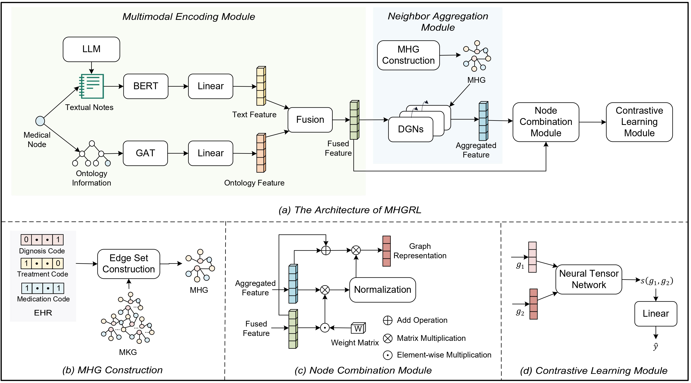

# MHGRL: An Effective Representation Learning Model for Electronic Health Records
## Overview of MHGRL

## Requirements
The code has been tested running under Python 3.10.4. The required packages are as follows:
* torch: 2.0.1+cu118
* torch_geometric: 2.3.1
* dill: 0.3.7
* numpy: 1.22.4
* pandas: 1.5.3
* install other packages if necessary
    ```bash
    pip install tqdm matplotlib scikit-learn
    ```

## Files

### data

The main folders and files are as follows:

```yaml
├── chatgpt_desc: Relevant content generated by ChatGPT
│   ├── atc_desc_emb.pkl: Embeddings representing medication descriptions
│   ├── diag_desc_emb.pkl: Embeddings representing diagnosis descriptions
│   ├── proce_desc_emb.pkl: Embeddings representing treatment descriptions
│   ├── ndc2atc_level4.csv: Embeddings representing treatment descriptions
│   ├── responses_atc.pkl: Responses related to medications
│   ├── responses_diag.pkl: Responses related to diagnoses
│   └── responses_proce.pkl: Responses related to treatments
├── data_process.ipynb: Data processing notebook
├── mimic3: MIMIC-III dataset
├── mimic4: MIMIC-IV dataset
└── ndc_atc
    └── ndc2rxnorm_mapping.txt: Mapping file from NDC to RxNorm codes

```

### code
The main folders and files are as follows:：
```yaml
├── build_tree.py: Construct medical ontology graph
├── graph_model.py: MHGRL model implementation
├── run.sh: Script to run the code
├── train.py: Training script
└── util.py: Utility functions
```

## Run the code

1. Download the MIMIC-III dataset and MIMIC-IV dataset, and place them in the following directories:

    (Here, we do not share the MIMIC-III and -IV datasets due to reasons of personal privacy, maintaining research standards, and legal considerations.)
- MIMIC-III dataset: ../data/mimic3/
- MIMIC-IV dataset: ../data/mimic4/

2. run `data/data_process.ipynb` to partition the dataset and build the knowledge graph. The output file information is as follows:

   | File Name            | Description                                  |
   |----------------------|----------------------------------------------|
   | diag_pres_rel.csv   | Relationships between diagnoses and medications   |
   | diag_proce_rel.csv  | Relationships between diagnoses and treatments |
   | proce_pres_rel.csv  | Relationships between treatments and medications  |
   | test_admissions.csv | Test set                                     |
   | train_admissions.csv| Training set                                 |
   | train_label.csv     | Similarity labels for training EHR pairs     |
   | valid_admissions.csv| Validation set                               |
   | vocab.pkl           | Vocabulary in the dataset                    |

3. Execute the `code/run.sh` file:

    ```bash
    sh run.sh
    ```
    #### optional arguments
    | Parameter| Type   | Possible Values                                | Description                                       |
    |------------------|--------|-----------------------------------------------|---------------------------------------------------|
    | dataset          | str    | mimic3, mimic4                                | Type of dataset                                   |
    | task             | str    | cluster, knn                                   | Downstream task, options are EHR clustering (cluster) or disease prediction (knn) |
    | gcn_conv_nums    | int    | Positive integers                             | Number of convolutional layers in the graph neural network |
    | learning_rate    | float  | -                                             | Learning rate                     |
    | hidden_size      | int    | Positive integers                             | Dimensionality of the hidden layer                |
    | pair_neurons     | int    | Positive integers                             | Number of neurons                                  |
    | batch_size       | int    | Positive integers                             | Batch size                        |
    | epoch            | int    | Positive integers                             | Number of iterations              |
    | use_conv         | str    | gcn, gat, rgcn, rgat, gps, anti               | Selected graph neural network model               |
    | train_data       | str    | -                                             | Path to the training dataset                      |
    | valid_cluster_data | str  | -                                             | Path to the validation dataset for clustering experiments |
    | test_cluster_data  | str  | -                                             | Path to the testing dataset for clustering experiments |
    | train_input_data  | str    | -                                             | Path to the training data used for retrieval in disease prediction tasks |
    | valid_knn_data    | str    | -                                             | Path to the validation dataset for disease prediction experiments |
    | test_knn_data     | str    | -                                             | Path to the testing dataset for disease prediction experiments |
    | output_dir        | str    | -                                             | Path to the output directory for results          |
    | do_train             | bool   | True, False                                   | Whether to perform training                       |
    | do_test              | bool   | True, False                                   | Whether to perform experiments on the test set    |
    | resume_path       | str    | -                                             | Name of the model to be used for testing          |
        